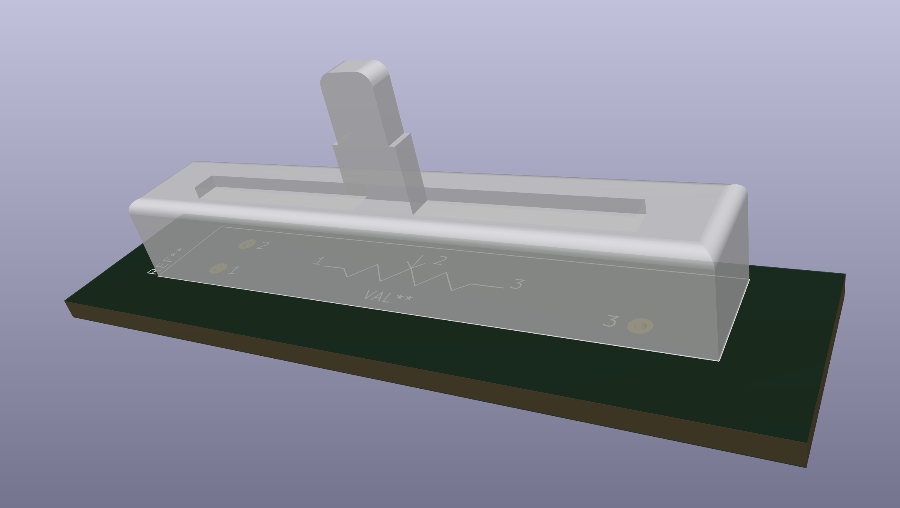

# Kromftronics - Custom KiCad Footprint & 3D Models

Custom footprints, symbols, and 3D model libraries created for KiCad, used for Kromftronics projects.

  

### Footprints
The [footprints](./footprints) directory contains a custom KiCad footprint library with `.kicad_mod` files.

### Symbols
The [symbols](./symbols) directory contains a symbols library `Kromftronics_Custom.kicad_sym` which contains different non-default KiCad schematic symbols.

### 3D Models
The [3d-models](./3d-models) directory contains the custom KiCad 3D models for the footprints.

### 3D Renders
The [images](./images) directory contains 3D renders of the footprints and the 3D models.
